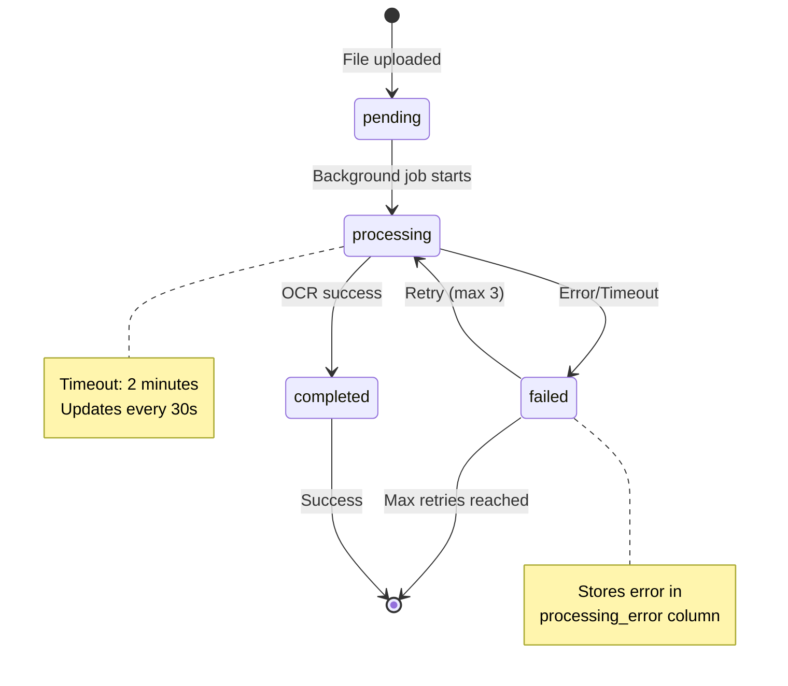
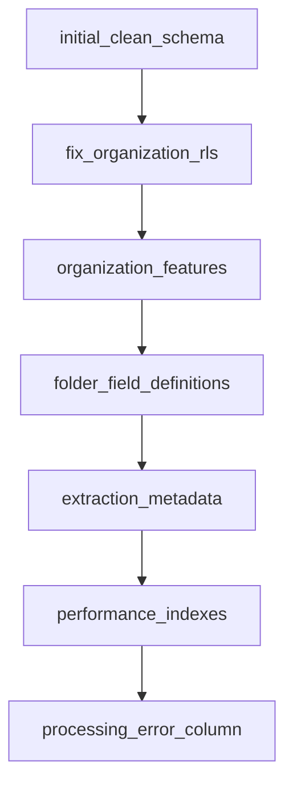

# OCR/AI System Documentation - Addendum

This addendum completes the main documentation with critical missing pieces for a complete source of truth.

## Table of Contents
1. [Environment Configuration](#environment-configuration)
2. [Error States and Handling](#error-states-and-handling)
3. [File Storage Details](#file-storage-details)
4. [API Endpoints](#api-endpoints)
5. [RLS Policies and Security](#rls-policies-and-security)
6. [Processing State Machine](#processing-state-machine)
7. [Monitoring and Debugging](#monitoring-and-debugging)
8. [Migration History](#migration-history)
9. [Testing Procedures](#testing-procedures)
10. [Cost Analysis](#cost-analysis)

## Environment Configuration

### Required Environment Variables
```bash
# Supabase Configuration (Local Development)
NEXT_PUBLIC_SUPABASE_URL=http://127.0.0.1:54321
NEXT_PUBLIC_SUPABASE_ANON_KEY=eyJhbGciOiJIUzI1NiIsInR5cCI6IkpXVCJ9...
SUPABASE_SERVICE_ROLE_KEY=eyJhbGciOiJIUzI1NiIsInR5cCI6IkpXVCJ9... # Required for background processing

# AI API Keys
OPENAI_API_KEY=sk-proj-... # Required for OCR with images
MISTRAL_API_KEY=... # Required for fallback OCR

# Application
NEXT_PUBLIC_APP_URL=http://localhost:3000

# Optional (Phase 2)
REDIS_HOST=localhost
REDIS_PORT=6379
REDIS_PASSWORD=
```

### Environment Setup
```bash
# Copy example environment
cp .env.example .env.local

# Required for local development
npm install
npx supabase start
npx supabase migration up --include-all
npm run dev
```

## Error States and Handling

### Error Hierarchy
```typescript
// 1. Upload Errors
- File too large (>10MB): "File size exceeds 10MB limit"
- Invalid type: "File type not supported. Use PDF, JPG, PNG, TIFF, or BMP"
- Storage failure: "Failed to upload file to storage"
- Database failure: "Failed to save file information"

// 2. Processing Errors
- Timeout (2 min): "Processing timeout exceeded"
- All providers failed: "Unable to process document with any provider"
- Invalid image: "Image could not be processed"
- No text found: "No text could be extracted from the document"

// 3. Field Extraction Errors
- Missing fields: "Required fields could not be extracted"
- Invalid format: "Extracted data does not match expected format"
```

### Retry Logic
```typescript
// Background processing retry configuration
const retryConfig = {
  maxAttempts: 3,
  initialDelay: 2000,    // 2 seconds
  maxDelay: 10000,       // 10 seconds
  backoffMultiplier: 2,  // 2s → 4s → 8s
  timeout: 120000        // 2 minutes total
};

// AI provider retry configuration
const aiRetryConfig = {
  maxRetries: 2,
  perProviderTimeout: 30000  // 30 seconds each
};
```

### User-Facing Error Messages
```typescript
// Error message mapping
const errorMessages = {
  'UPLOAD_TOO_LARGE': 'El archivo es demasiado grande (máximo 10MB)',
  'INVALID_FILE_TYPE': 'Tipo de archivo no soportado',
  'PROCESSING_FAILED': 'Error al procesar el documento. Reintentando...',
  'OCR_FAILED': 'No se pudo extraer texto del documento',
  'NETWORK_ERROR': 'Error de conexión. Por favor, intente nuevamente',
  'QUOTA_EXCEEDED': 'Límite de procesamiento alcanzado'
};
```

## File Storage Details

### Storage Structure
```
supabase/storage/
└── organization-files/          # Bucket name
    └── {organization_id}/       # Organization folder
        └── {timestamp}_{sanitized_filename}  # File naming
            # Example: 1706789012345_invoice_scan.pdf
```

### File Constraints
```typescript
const FILE_CONSTRAINTS = {
  maxSize: 10 * 1024 * 1024,  // 10MB in bytes
  allowedTypes: [
    'application/pdf',
    'image/jpeg',
    'image/jpg',
    'image/png',
    'image/tiff',
    'image/bmp'
  ],
  allowedExtensions: ['.pdf', '.jpg', '.jpeg', '.png', '.tiff', '.bmp'],
  
  // Sanitization rules
  filenameSanitization: /[^a-zA-Z0-9.-]/g,  // Replace with _
  maxFilenameLength: 255
};
```

### Storage Policies
```sql
-- RLS policies for storage bucket
CREATE POLICY "Users can upload to their organization" ON storage.objects
  FOR INSERT TO authenticated
  USING (bucket_id = 'organization-files' AND auth.uid() IN (
    SELECT user_id FROM organization_memberships 
    WHERE organization_id = (storage.foldername(name))[1]::uuid
  ));

CREATE POLICY "Users can view their organization files" ON storage.objects
  FOR SELECT TO authenticated
  USING (bucket_id = 'organization-files' AND auth.uid() IN (
    SELECT user_id FROM organization_memberships 
    WHERE organization_id = (storage.foldername(name))[1]::uuid
  ));
```

## API Endpoints

### Document Status Endpoint
```typescript
// GET /api/documents/[id]/status
// Returns current processing status and metadata

Response: {
  status: 'pending' | 'processing' | 'completed' | 'failed',
  progress?: number,  // 0-100 for processing status
  error?: string,     // Only if failed
  result?: {
    hasOcrText: boolean,
    hasExtractedData: boolean,
    confidence: number,
    processingTime: number  // milliseconds
  }
}

// Implementation uses: await params (Next.js 15 requirement)
```

### Document Thumbnail Endpoint
```typescript
// GET /api/documents/[id]/thumbnail
// Returns thumbnail URL for images only

Response: {
  url: string,  // Signed URL with 1hr expiry
  cached_until: string  // ISO timestamp
}

// Features:
- Only works for image files
- Uses Supabase transform for resizing (200x200)
- Cached for 1 hour
- Returns 400 for non-images
```

### Document Download Endpoint
```typescript
// GET /api/documents/[id]/download
// Returns signed URL for file download

Response: {
  url: string,  // Signed URL with 1hr expiry
  filename: string,
  content_type: string
}
```

## RLS Policies and Security

### Tables with RLS Enabled
```sql
-- All tables have RLS enabled except migrations
ALTER TABLE files ENABLE ROW LEVEL SECURITY;
ALTER TABLE file_analysis ENABLE ROW LEVEL SECURITY;
ALTER TABLE folders ENABLE ROW LEVEL SECURITY;
ALTER TABLE folder_field_definitions ENABLE ROW LEVEL SECURITY;
ALTER TABLE extracted_data ENABLE ROW LEVEL SECURITY;
ALTER TABLE organizations ENABLE ROW LEVEL SECURITY;
ALTER TABLE organization_memberships ENABLE ROW LEVEL SECURITY;
```

### Service Role Bypass
```typescript
// Service role automatically bypasses RLS
// Used in background processing with:
const client = createClient(url, SUPABASE_SERVICE_ROLE_KEY);

// This allows background jobs to:
- Access any document regardless of user
- Update processing status
- Save OCR results
- No need for user context
```

### User Access Patterns
```sql
-- Users can only access files in their organization
CREATE POLICY "Users can view organization files" ON files
  FOR SELECT TO authenticated
  USING (
    organization_id IN (
      SELECT organization_id FROM organization_memberships
      WHERE user_id = auth.uid() AND is_active = true
    )
  );

-- Similar policies for INSERT, UPDATE, DELETE
```

## Processing State Machine



### State Transitions
```typescript
// State transition rules
const stateTransitions = {
  'pending': ['processing'],
  'processing': ['completed', 'failed'],
  'failed': ['processing'],  // Only via manual retry
  'completed': []  // Terminal state
};

// State update with timestamp
await supabase.from('files').update({
  processing_status: newStatus,
  updated_at: new Date().toISOString(),
  processing_error: error?.message  // Only for failed state
});
```

## Monitoring and Debugging

### Console Log Patterns
```typescript
// Standard log format: [Component] Message: details

// Examples:
console.log('[Upload] File uploaded successfully:', { id, name, size });
console.log('[Process] Starting processing for document:', documentId);
console.log('[Pool] Reusing connection. Pool size: 1, Active: 1');
console.log('[AI] Converting image URL to base64:', { imageUrl, fileType });
console.error('[Process] Document processing error:', { documentId, error, stack });
```

### Performance Metrics
```typescript
// Key metrics to monitor
const metrics = {
  // Upload metrics
  uploadDuration: 'Time from select to storage complete',
  uploadSize: 'File size in MB',
  uploadSuccess: 'Success rate percentage',
  
  // Processing metrics
  processingDuration: 'Time from start to complete/failed',
  ocrProvider: 'Which provider was used',
  ocrConfidence: 'Confidence score 0-1',
  retryCount: 'Number of retries needed',
  
  // Database metrics
  queryCount: 'Number of queries per operation',
  poolUtilization: 'Active connections / pool size',
  
  // Cost metrics
  apiCalls: 'Number of AI API calls',
  tokensUsed: 'Approximate tokens consumed'
};
```

### Common Failure Scenarios
```typescript
// 1. Local development URL issue
Error: "Error while downloading http://127.0.0.1:54321/storage..."
Fix: Base64 conversion implemented for OpenAI

// 2. Missing column
Error: "column files.created_by does not exist"
Fix: Use correct column name (user_id)

// 3. Authentication in background
Error: "User not authenticated"
Fix: Use service role for background processing

// 4. Race condition
Error: "Document not found"
Fix: 100ms delay before processing

// 5. Large file timeout
Error: "Processing timeout exceeded"
Fix: Increase timeout or reduce file size
```

## Migration History

### Applied Migrations (Chronological Order)
```sql
-- Core schema
20250101000000_initial_clean_schema.sql         -- Base tables
20250102000000_fix_organization_rls.sql         -- RLS policies
20250102001000_proper_organization_rls.sql       -- RLS fixes

-- Organization features
20250126000000_fix_organization_security.sql     -- Security policies
20250126000001_organization_invitation_functions.sql -- Invite system

-- OCR/AI features
20250710000000_add_extract_data_to_folders.sql   -- Field extraction flag
20250711000000_create_folder_field_definitions.sql -- Field definitions
20250711000001_fix_folder_field_definitions.sql   -- Schema fixes
20250712000000_add_extraction_metadata_to_extracted_data.sql -- Metadata

-- Performance
20250713000000_add_critical_performance_indexes.sql -- Indexes
20250713000001_consolidate_extraction_tables.sql    -- Table optimization
20250713000002_create_optimized_views.sql          -- Materialized views
20250713000003_complete_extraction_cleanup.sql      -- Cleanup
20250713000004_add_storage_rls_policies.sql        -- Storage RLS
20250713000005_setup_background_processing.sql      -- Background jobs

-- Bug fixes
20250729000000_add_processing_error_column.sql     -- Error tracking
```

### Migration Dependencies


### Rollback Procedures
```bash
# Rollback single migration
npx supabase migration revert

# Reset to clean state (DESTRUCTIVE)
npx supabase db reset --local

# Apply specific migration
npx supabase migration up --include-all
```

## Testing Procedures

### Local Testing Setup
```bash
# 1. Start Supabase locally
npx supabase start

# 2. Apply migrations
npx supabase migration up --include-all

# 3. Set environment variables
cp .env.example .env.local
# Add your OpenAI and Mistral API keys

# 4. Start development server
npm run dev
```

### Test Scenarios
```typescript
// 1. Basic Upload Test
- Upload single image (< 1MB)
- Verify status updates: pending → processing → completed
- Check OCR text extracted

// 2. Bulk Upload Test
- Upload 5 files simultaneously
- Verify optimistic UI shows all files
- Check connection pool efficiency

// 3. Large File Test
- Upload 9MB PDF
- Monitor memory usage
- Verify streaming upload works

// 4. Error Recovery Test
- Disconnect network during processing
- Verify retry logic kicks in
- Check error is logged properly

// 5. Field Extraction Test
- Create folder with extract_data = true
- Add field definitions
- Upload document and verify extraction
```

### Mock Data for Development
```typescript
// Mock OCR response
const mockOCRResult: ProcessingResult = {
  ocrText: "FACTURA #001-2024\nCliente: Acme Corp\nTotal: $1,500.00",
  description: "Factura comercial con información de cliente y monto total",
  tags: ["factura", "comercial", "acme"],
  confidence: 0.95,
  provider: "openai-gpt4-vision",
  extractedData: {
    invoice_number: "001-2024",
    client_name: "Acme Corp",
    total_amount: 1500.00
  }
};

// Mock field definitions
const mockFieldDefinitions: FieldDefinition[] = [
  {
    field_name: "invoice_number",
    field_type: "text",
    field_label: "Número de Factura",
    is_required: true
  },
  {
    field_name: "total_amount",
    field_type: "currency",
    field_label: "Monto Total",
    is_required: true
  }
];
```

## Cost Analysis

### AI API Costs (as of 2024)
```typescript
// OpenAI GPT-4 Vision
const openaiCosts = {
  model: 'gpt-4o-mini',
  inputTokens: {
    text: 0.00015,      // per 1K tokens
    image: 0.01275      // per image (auto-sized)
  },
  outputTokens: 0.0006, // per 1K tokens
  
  // Average per document
  averageImageCost: 0.01275,  // 1 image
  averageTokensCost: 0.00045, // ~3K tokens total
  totalPerDocument: 0.0132    // ~$0.013 per document
};

// Mistral API
const mistralCosts = {
  model: 'mistral-small-latest',
  inputTokens: 0.0002,   // per 1K tokens
  outputTokens: 0.0006,  // per 1K tokens
  
  // Average per document
  averageTokensCost: 0.0008,  // ~4K tokens total
  totalPerDocument: 0.0008    // ~$0.0008 per document
};

// Storage Costs (Supabase)
const storageCosts = {
  storage: 0.021,        // per GB per month
  bandwidth: 0.09,       // per GB downloaded
  
  // Average document
  averageSize: 0.5,      // MB per document
  monthlyCost: 0.00001,  // Per document stored
  downloadCost: 0.000045 // Per download
};
```

### Cost Optimization Strategies
```typescript
// 1. Caching (Phase 2)
- 60% cache hit rate = 60% cost reduction
- Redis storage much cheaper than AI calls

// 2. Selective Processing
- Skip OCR for duplicate files (content hash)
- Only extract fields when folder requires it

// 3. Provider Selection
- Use Mistral for simple documents (10x cheaper)
- Reserve OpenAI for complex images

// 4. Batch Processing
- Group similar documents
- Share context between operations
```

### Monthly Cost Projection
```typescript
// Assumptions: 1000 documents/month
const monthlyProjection = {
  withoutOptimization: {
    aiCalls: 1000 * 0.0132,      // $13.20
    storage: 1000 * 0.5 * 0.021,  // $0.01
    bandwidth: 1000 * 0.5 * 0.09, // $0.45
    total: 13.66                  // $13.66/month
  },
  
  withOptimization: {
    aiCalls: 400 * 0.0132,        // $5.28 (60% cached)
    storage: 1000 * 0.5 * 0.021,  // $0.01
    bandwidth: 1000 * 0.5 * 0.09, // $0.45
    caching: 2.00,                // $2.00 Redis
    total: 7.74                   // $7.74/month (43% savings)
  }
};
```

---

This addendum completes the documentation as a comprehensive source of truth. Combined with the main documentation, you now have:

1. **Complete system understanding** - Architecture, flows, and implementation
2. **Operational knowledge** - How to run, test, and debug
3. **Financial visibility** - Costs and optimization strategies
4. **Error handling** - All failure modes and recovery
5. **Security model** - RLS policies and access control
6. **Future roadmap** - What's next and how to implement it

This should serve as the definitive reference for the OCR/AI system.