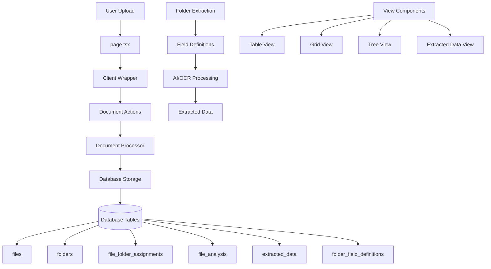
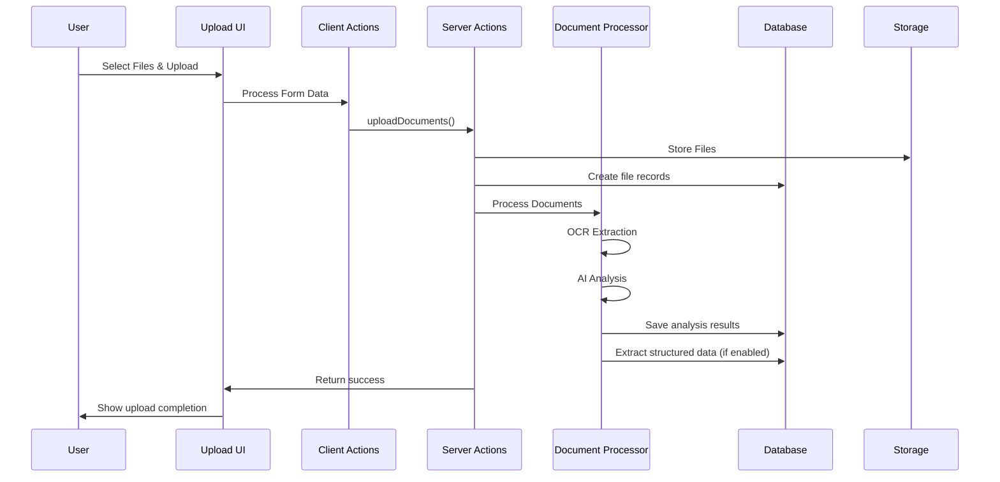
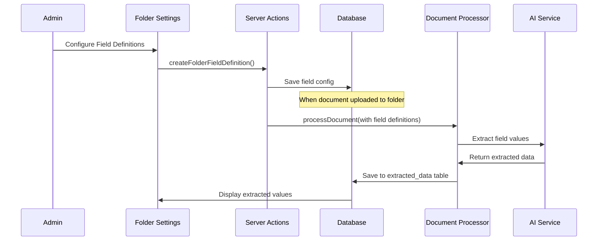
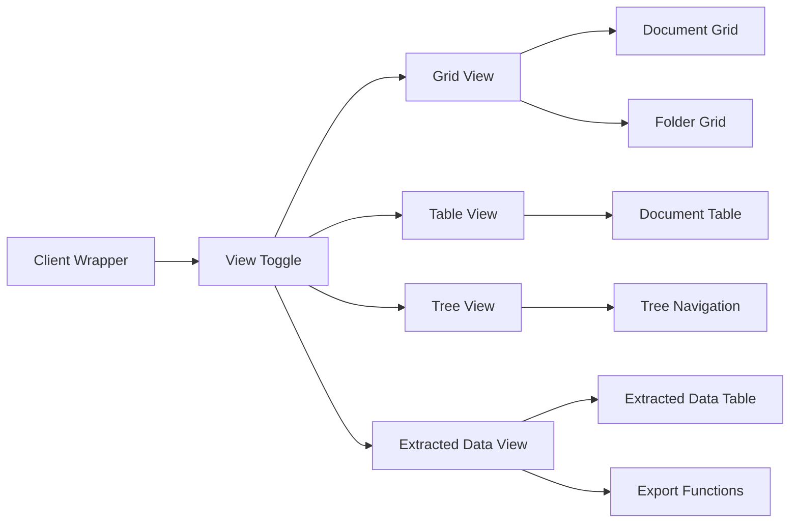

# Files Management System - Complete Architecture & Flow

A comprehensive file management system for construction project documents with AI-powered data extraction capabilities. This system provides Google Drive-like functionality with advanced features for construction project management.

## 📊 System Architecture



## 🏗️ Folder Structure

```
app/(sidebar)/files/
├── page.tsx                          # Main server component entry point
├── schema.ts                         # Zod validation schemas & constants
├── types.ts                          # TypeScript type definitions
├── README.md                         # This documentation
│
├── actions/                          # Server Actions (Database Operations)
│   ├── document-actions.ts           # Document CRUD operations
│   └── folder-extraction-actions.ts  # Folder extraction & field management
│
├── components/                       # React Components
│   ├── client-wrapper.tsx            # Main client-side orchestrator
│   ├── document-table-view.tsx       # Table view for documents
│   ├── document-tree-view.tsx        # Hierarchical tree navigation
│   ├── extracted-data-view.tsx       # Data extraction results display
│   ├── search-and-filters.tsx        # Search & filtering interface
│   ├── view-toggle.tsx               # View mode switcher
│   │
│   ├── documents/                    # Document-specific components
│   │   ├── add-document-card.tsx     # Quick upload interface
│   │   ├── document-grid.tsx         # Grid layout for documents
│   │   └── document-preview-sheet.tsx # Document preview modal
│   │
│   └── folders/                      # Folder-specific components
│       ├── folder-grid.tsx           # Folder grid display
│       └── folder-settings-dialog.tsx # Folder configuration UI
│
└── services/                         # Business Logic & Processing
    ├── document-processor.ts         # Core document processing engine
    ├── example-invoice-processor.ts  # Example extraction templates
    └── url-ocr-functions.ts          # OCR & AI processing utilities
```

## 🗄️ Database Schema

### Core Tables

#### 1. **files** - Document Storage
```sql
CREATE TABLE public.files (
    id UUID PRIMARY KEY DEFAULT gen_random_uuid(),
    organization_id UUID NOT NULL REFERENCES public.organizations(id) ON DELETE CASCADE,
    user_id UUID NOT NULL REFERENCES auth.users(id) ON DELETE CASCADE,
    name TEXT NOT NULL,                    -- Display name
    original_name TEXT NOT NULL,           -- Original filename
    file_type TEXT NOT NULL,               -- MIME type
    file_size BIGINT NOT NULL,             -- Size in bytes
    storage_path TEXT NOT NULL,            -- Storage location path
    checksum TEXT,                         -- File integrity hash
    is_active BOOLEAN DEFAULT true,        -- Soft delete flag
    processing_status TEXT DEFAULT 'pending' CHECK (processing_status IN ('pending', 'processing', 'completed', 'failed')),
    created_at TIMESTAMPTZ NOT NULL DEFAULT NOW(),
    updated_at TIMESTAMPTZ NOT NULL DEFAULT NOW()
);
```

#### 2. **folders** - Folder Organization
```sql
CREATE TABLE public.folders (
    id UUID PRIMARY KEY DEFAULT gen_random_uuid(),
    organization_id UUID NOT NULL REFERENCES public.organizations(id) ON DELETE CASCADE,
    user_id UUID NOT NULL REFERENCES auth.users(id) ON DELETE CASCADE,
    name TEXT NOT NULL,                    -- Folder display name
    description TEXT,                      -- Optional description
    color TEXT DEFAULT '#3B82F6',          -- UI color theme
    icon TEXT DEFAULT '📁',                -- Display icon
    sort_order INTEGER DEFAULT 0,          -- Display ordering
    is_active BOOLEAN DEFAULT true,        -- Soft delete flag
    extract_data BOOLEAN DEFAULT false,    -- Enable AI extraction for this folder
    created_at TIMESTAMPTZ NOT NULL DEFAULT NOW(),
    updated_at TIMESTAMPTZ NOT NULL DEFAULT NOW(),
    UNIQUE(organization_id, name)
);
```

#### 3. **file_folder_assignments** - Document-Folder Relationships
```sql
CREATE TABLE public.file_folder_assignments (
    id UUID PRIMARY KEY DEFAULT gen_random_uuid(),
    file_id UUID NOT NULL REFERENCES public.files(id) ON DELETE CASCADE,
    folder_id UUID NOT NULL REFERENCES public.folders(id) ON DELETE CASCADE,
    user_id UUID NOT NULL REFERENCES auth.users(id) ON DELETE CASCADE,
    sort_order INTEGER DEFAULT 0,          -- File ordering within folder
    created_at TIMESTAMPTZ NOT NULL DEFAULT NOW(),
    UNIQUE(file_id, folder_id)             -- One file per folder assignment
);
```

### AI & Processing Tables

#### 4. **file_analysis** - OCR & AI Analysis Results
```sql
CREATE TABLE public.file_analysis (
    id UUID PRIMARY KEY DEFAULT gen_random_uuid(),
    file_id UUID NOT NULL REFERENCES public.files(id) ON DELETE CASCADE,
    user_id UUID NOT NULL REFERENCES auth.users(id) ON DELETE CASCADE,
    ocr_text TEXT,                         -- Full OCR extracted text
    ai_description TEXT,                   -- AI-generated description
    ai_category TEXT,                      -- AI-suggested category
    ai_tags TEXT[] DEFAULT '{}',           -- AI-generated tags
    confidence_score DECIMAL DEFAULT 0,    -- Overall confidence (0-1)
    analysis_metadata JSONB DEFAULT '{}', -- Processing metadata
    created_at TIMESTAMPTZ NOT NULL DEFAULT NOW(),
    updated_at TIMESTAMPTZ NOT NULL DEFAULT NOW(),
    UNIQUE(file_id)                        -- One analysis per file
);
```

#### 5. **folder_field_definitions** - Extraction Field Configuration
```sql
CREATE TABLE public.folder_field_definitions (
    id UUID PRIMARY KEY DEFAULT gen_random_uuid(),
    folder_id UUID NOT NULL REFERENCES public.folders(id) ON DELETE CASCADE,
    organization_id UUID NOT NULL REFERENCES public.organizations(id) ON DELETE CASCADE,
    user_id UUID NOT NULL,
    field_name TEXT NOT NULL,              -- Internal field identifier
    field_label TEXT NOT NULL,             -- Display label
    field_type TEXT NOT NULL,              -- Data type (text, number, date, etc.)
    field_description TEXT,                -- Help text
    extraction_method TEXT NOT NULL,       -- 'regex', 'ai', 'hybrid'
    extraction_pattern TEXT NOT NULL,      -- Regex pattern or AI prompt
    validation_pattern TEXT,               -- Validation regex
    default_value TEXT,                    -- Default value if not found
    is_required BOOLEAN DEFAULT false,     -- Required field flag
    is_active BOOLEAN DEFAULT true,        -- Enable/disable field
    sort_order INTEGER,                    -- Display order
    created_at TIMESTAMPTZ DEFAULT NOW(),
    updated_at TIMESTAMPTZ DEFAULT NOW()
);
```

#### 6. **extracted_data** - Extracted Field Values
```sql
CREATE TABLE public.extracted_data (
    id UUID PRIMARY KEY DEFAULT gen_random_uuid(),
    file_id UUID NOT NULL REFERENCES public.files(id) ON DELETE CASCADE,
    folder_id UUID NOT NULL REFERENCES public.folders(id) ON DELETE CASCADE,
    extraction_config_id UUID NOT NULL REFERENCES public.folder_extraction_configs(id) ON DELETE CASCADE,
    user_id UUID NOT NULL REFERENCES auth.users(id) ON DELETE CASCADE,
    extracted_value TEXT,                  -- The extracted value
    confidence_score DECIMAL DEFAULT 0,    -- Extraction confidence (0-1)
    is_verified BOOLEAN DEFAULT false,     -- Human verification status
    verification_notes TEXT,               -- Verification comments
    extraction_metadata JSONB DEFAULT '{}', -- Processing metadata
    created_at TIMESTAMPTZ NOT NULL DEFAULT NOW(),
    updated_at TIMESTAMPTZ NOT NULL DEFAULT NOW(),
    UNIQUE(file_id, extraction_config_id)  -- One value per field per file
);
```

#### 7. **folder_extraction_configs** - Legacy Extraction Configuration
```sql
CREATE TABLE public.folder_extraction_configs (
    id UUID PRIMARY KEY DEFAULT gen_random_uuid(),
    folder_id UUID NOT NULL REFERENCES public.folders(id) ON DELETE CASCADE,
    user_id UUID NOT NULL REFERENCES auth.users(id) ON DELETE CASCADE,
    field_name TEXT NOT NULL,
    field_label TEXT NOT NULL,
    field_type TEXT NOT NULL CHECK (field_type IN ('text', 'number', 'date', 'currency', 'boolean', 'email', 'phone')),
    extraction_pattern TEXT,               -- AI prompt or regex pattern
    is_required BOOLEAN DEFAULT false,
    default_value TEXT,
    sort_order INTEGER DEFAULT 0,
    is_active BOOLEAN DEFAULT true,
    created_at TIMESTAMPTZ NOT NULL DEFAULT NOW(),
    updated_at TIMESTAMPTZ NOT NULL DEFAULT NOW(),
    UNIQUE(folder_id, field_name)
);
```

## 🔄 System Flow Diagrams

### 1. Document Upload Flow



### 2. Folder-Based Data Extraction Flow



### 3. Multi-View Navigation Flow



## 🧩 Component Architecture

### Core Components

#### **page.tsx** - Server Entry Point
- Server-side data fetching
- Search parameter handling
- Initial filtering logic
- Error boundary handling

**Key Functions:**
```typescript
// Fetches documents and folders for organization
const [documentsResult, foldersResult] = await Promise.all([
  getOrganizationDocumentsWithFolders(),
  getOrganizationFolders()
]);
```

#### **client-wrapper.tsx** - Client Orchestrator
- View state management
- Search & filter coordination
- Navigation breadcrumbs
- Real-time UI updates

**Key Features:**
- Multiple view modes (cards, table, extracted data)
- Dynamic search & filtering
- Folder navigation with breadcrumbs
- Settings dialog integration

#### **document-actions.ts** - Server Actions Hub
- All database operations for documents & folders
- File upload processing
- Document analysis coordination
- Data extraction management

**Key Actions:**
- `uploadDocuments()` - Handle file uploads
- `getOrganizationDocumentsWithFolders()` - Fetch documents with folder info
- `createFolder()` - Create new folders
- `updateDocument()` - Update document metadata
- `deleteDocument()` - Soft delete documents

### Specialized Components

#### **Document Grid/Table Views**
- **document-grid.tsx**: Card-based document display
- **document-table-view.tsx**: Tabular document listing
- **document-tree-view.tsx**: Hierarchical folder navigation

#### **Folder Management**
- **folder-grid.tsx**: Visual folder browser
- **folder-settings-dialog.tsx**: Folder configuration UI
- Field definition management
- Extraction settings

#### **Data Extraction**
- **extracted-data-view.tsx**: Display extracted field values
- **document-processor.ts**: Core AI/OCR processing logic
- **example-invoice-processor.ts**: Template extraction examples

## ⚙️ Configuration & Constants

### Document Categories
```typescript
const DOCUMENT_CATEGORIES = [
  { id: 'planos', name: 'Planos', icon: '📐', color: 'blue' },
  { id: 'fotos', name: 'Fotos', icon: '📸', color: 'green' },
  { id: 'informes', name: 'Informes', icon: '📋', color: 'yellow' },
  { id: 'contratos', name: 'Contratos', icon: '📄', color: 'purple' },
  { id: 'permisos', name: 'Permisos', icon: '✅', color: 'cyan' },
  { id: 'facturas', name: 'Facturas', icon: '🧾', color: 'orange' },
  { id: 'avance', name: 'Avance de Obra', icon: '📊', color: 'red' },
  { id: 'materiales', name: 'Materiales', icon: '🧱', color: 'brown' },
  { id: 'certificados', name: 'Certificados', icon: '🏆', color: 'gold' },
  { id: 'correspondencia', name: 'Correspondencia', icon: '✉️', color: 'pink' },
  { id: 'otros', name: 'Otros', icon: '📁', color: 'gray' }
];
```

### Supported File Types
```typescript
const ALLOWED_MIME_TYPES = [
  'image/jpeg', 'image/png', 'image/webp', 'image/gif',
  'application/pdf',
  'application/msword', 'application/vnd.openxmlformats-officedocument.wordprocessingml.document',
  'application/vnd.ms-excel', 'application/vnd.openxmlformats-officedocument.spreadsheetml.sheet',
  'application/vnd.ms-powerpoint', 'application/vnd.openxmlformats-officedocument.presentationml.presentation',
  'text/plain', 'text/csv',
  'application/zip', 'application/x-rar-compressed',
  'application/dwg', 'application/dxf'
];
```

### Field Types for Data Extraction
```typescript
const FIELD_TYPES = ['text', 'number', 'date', 'currency', 'boolean', 'email', 'phone'];
const EXTRACTION_METHODS = ['regex', 'ai', 'hybrid'];
```

## 🤖 AI & Processing Features

### Document Processing Pipeline
1. **File Upload** → Storage (Supabase Storage)
2. **OCR Processing** → Text extraction from images/PDFs
3. **AI Analysis** → Description, categorization, tagging
4. **Structured Extraction** → Field-specific data extraction (if folder configured)
5. **Database Storage** → Save all analysis results

### Data Extraction Configuration
- **Field Definitions**: Custom fields per folder
- **Extraction Methods**: Regex patterns, AI prompts, or hybrid approaches
- **Validation**: Custom validation patterns
- **Confidence Scoring**: AI confidence levels for extracted values
- **Human Verification**: Manual review and correction workflow

### Supported AI Providers
- OpenAI GPT models for text analysis
- Mistral AI for alternative processing
- Custom OCR integration for text extraction

## 🔒 Security & Permissions

### Row Level Security (RLS)
All tables implement organization-based RLS policies:
- Users can only access data from their organization
- User-specific permissions for create/update operations
- Automatic organization context from user authentication

### Authentication Flow
1. User authentication via Supabase Auth
2. Organization membership verification
3. RLS policy enforcement on all database operations
4. User context passed to all server actions

## 📱 User Interface Features

### Multiple View Modes
- **Grid View**: Card-based visual browsing
- **Table View**: Detailed tabular listing with sorting
- **Tree View**: Hierarchical folder navigation
- **Extracted Data View**: Structured data display with export options

### Search & Filtering
- **Full-text search**: Document names and descriptions
- **Category filtering**: Filter by document categories
- **Folder filtering**: Browse by folder structure
- **Tag filtering**: Filter by document tags

### Real-time Features
- **Live search**: Instant search results as you type
- **Dynamic filtering**: Immediate filter application
- **Progress indicators**: Upload and processing status
- **Error handling**: Graceful error display and recovery

## 🚀 Performance Optimizations

### Database Optimizations
- **Indexed queries**: Proper indexing on frequently queried columns
- **Efficient joins**: Optimized table relationships
- **Paginated results**: Server-side pagination for large datasets
- **Cached metadata**: Stored analysis results to avoid reprocessing

### Client-side Optimizations
- **Lazy loading**: Components loaded on demand
- **Virtualized lists**: Efficient rendering of large file lists
- **Debounced search**: Reduced API calls during typing
- **Optimistic updates**: Immediate UI feedback for user actions

## 🔧 Development Guidelines

### Adding New Document Categories
1. Update `DOCUMENT_CATEGORIES` in `schema.ts`
2. Add corresponding icons and colors
3. Update type definitions in `types.ts`
4. Test category filtering and display

### Creating Custom Extraction Templates
1. Study `example-invoice-processor.ts`
2. Define field patterns in `folder-field-definitions`
3. Test extraction accuracy with sample documents
4. Implement validation rules

### Extending File Type Support
1. Add MIME types to `ALLOWED_MIME_TYPES`
2. Update file type icons in `FILE_TYPE_ICONS`
3. Test upload and processing workflows
4. Verify preview functionality

## 📈 Monitoring & Analytics

### Processing Metrics
- **Upload success rates**: Track file upload reliability
- **Processing times**: Monitor OCR and AI processing performance
- **Extraction accuracy**: Confidence scores and verification rates
- **Error rates**: Track and analyze processing failures

### Usage Analytics
- **Document counts**: Track documents per organization/folder
- **View preferences**: Monitor which view modes are most used
- **Search patterns**: Analyze common search terms and filters
- **Feature adoption**: Track usage of extraction and AI features

## 🚨 Critical Setup Requirements

### Storage RLS Policies (REQUIRED)

**⚠️ IMPORTANT**: The file storage system requires manual setup of Row Level Security policies on the `storage.objects` table. Without these policies, users will not be able to access uploaded files.

**Setup Instructions**: See `STORAGE_SETUP.md` in the project root for detailed instructions.

**Quick Setup**: Apply these storage policies via Supabase Dashboard or service role key:
- View files policy (SELECT)
- Upload files policy (INSERT) 
- Update files policy (UPDATE)
- Delete files policy (DELETE)

All policies check organization membership and file path structure: `{organization_id}/{filename}`

### Database Migrations

All database migrations are included and will be applied automatically:
- ✅ Performance indexes
- ✅ Optimized views 
- ✅ Table consolidation
- ✅ Helper functions
- ⚠️ Storage policies (manual setup required)

---

Perfect for construction project document management with AI-powered insights! 🏗️✨